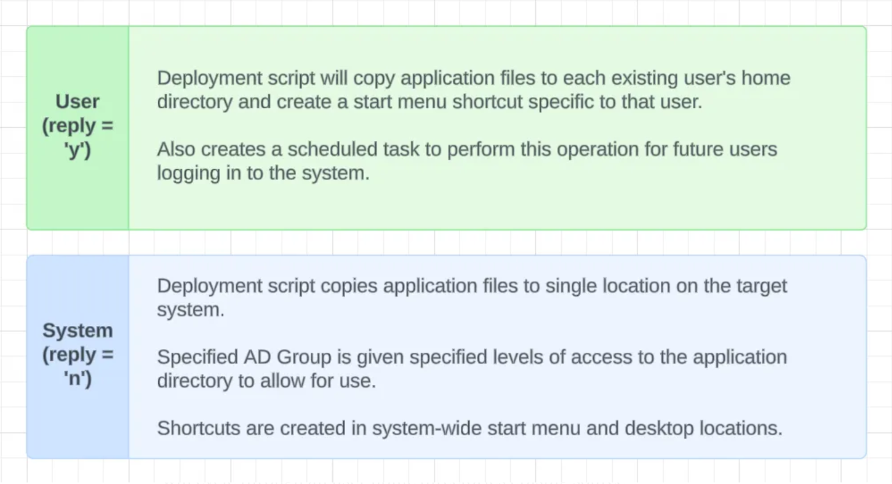

# psadt-install-framework


This 'framework' should be used to 'install' an application on a Windows system. 'Install' is in quotes because this framework
was constructed to create installation packages for applications that don't have traditional MSI or EXE installers.

Creation of VS Code installation package: [https://medium.com/@abuddenb/source-file-installation-framework-using-the-powershell-app-deployment-toolkit-19af4fde4b58](https://medium.com/@abuddenb/source-file-installation-framework-using-the-powershell-app-deployment-toolkit-19af4fde4b58)

A slightly more involved example, which includes dependencies and shows a 'user' installation.

Creation of <b>HandBrake</b> installation package: [https://medium.com/@abuddenb/psadt-install-framework-with-dependency-walkthrough-handbrake-99b78734e007](https://medium.com/@abuddenb/psadt-install-framework-with-dependency-walkthrough-handbrake-99b78734e007)

## Table of Contents

- [Introduction](#introduction)
- [Usage](#usage)
- [Configuration](#configuration)
- [Installation_Types](#installation_types)
- [Dependencies](#dependencies)
- [Uninstall](#uninstall)
- [Resources](#resources)

## Introduction

<b>The framework performs a few basic tasks:</b>
<ol>
    <li>Copies source folder/files to target location on Windows system</li>
    <li>Creates system-wide Desktop and Start Menu shortcuts that point to application executable</li>
    <li>Creates entry in Windows registry to make application 'visible' through Apps & Features</li>
    <li>Compiles uninstall-Application.exe, cited in the registry entry's Uninstallstring, that will wipe source files and shortcuts from system</li>

</ol>

## Usage

This is the most basic usage of this system - no dependencies are required for VS Code, and the walkthrough shows a 'system' installation.

Creation of VS Code installation package: [https://medium.com/@abuddenb/source-file-installation-framework-using-the-powershell-app-deployment-toolkit-19af4fde4b58](https://medium.com/@abuddenb/source-file-installation-framework-using-the-powershell-app-deployment-toolkit-19af4fde4b58)

A slightly more involved example, which includes dependencies and shows a 'user' installation.

Creation of <b>HandBrake</b> installation package: [https://medium.com/@abuddenb/psadt-install-framework-with-dependency-walkthrough-handbrake-99b78734e007](https://medium.com/@abuddenb/psadt-install-framework-with-dependency-walkthrough-handbrake-99b78734e007)

HandBrake requires Microsoft .NET Runtime 8.0, so the article listed above also covers how to respond to dependency-related
prompts from the configuration script.

## Configuration

Execute the repository's configuration script to set up the directory structure and filenames for your deployment.

```powershell
Powershell.exe -ExecutionPolicy Bypass ./replace.ps1
```

## Installation_Types

This system supports two <i>types of installations</i>: 'user' or 'system'. The difference between the two types is that in addition to copying application files to single location on target system, a 'user' installation will also copy the application files to current and future users' home directories.
<div style="max-width: 60%;margin: 0 auto;">

</div>

## Dependencies

The entire deployment can be configured through <b>replace.ps1</b>. The script creates a list of 'dependency objects' that it will check for and install before dealing with the main application files.

Each dependency object has the following properties:

<ul>
    <li><b>File</b>: the exact filename of the dependency's installer.</li>
    <li><b>AppName</b>: the Display Name of the dependency after it has been installed on a system.*</li>
    <li><b>Silent Switches</b>: arguments to pass to installer so it executes silently.</li>
</ul>

*Replace.ps1 also offers a mechanism to query the Windows registry for the Display Name of a dependency. This comes in handy if the dependency is already installed on the system from which you are creating the deployment package.

## Uninstall

The deployment script uses the <b>PS2EXE</b> Powershell module to compile an executable that removes application source files, shortcuts, and scheduled tasks from the system.

The executable is compiled and stored in: <b>C:\WINDOWS\SysWow64\AppName\uninstall-AppName.exe</b>

## Resources

1. [PSADT](https://psappdeploytoolkit.com/)
2. [PS2exe](https://github.com/MScholtes/PS2EXE)