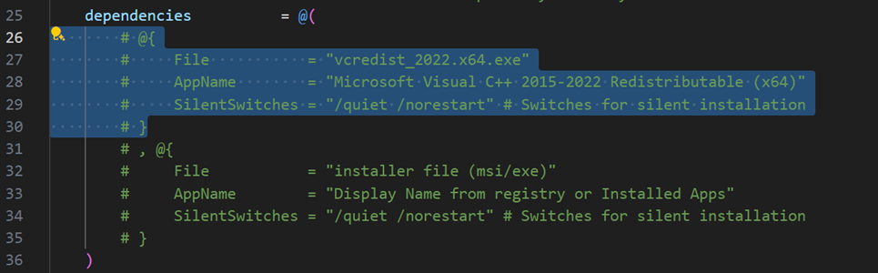

# psadt-install-framework

## Created by Alex B., 2024

This 'framework' should be used to 'install' an application on a Windows system. 'Install' is in quotes because this framework
was constructed to create installation packages for applications that don't have traditional MSI or EXE installers.

Application that can be installed with this framework:

[https://code.visualstudio.com/sha/download?build=stable&os=win32-x64-archive](https://code.visualstudio.com/sha/download?build=stable&os=win32-x64-archive)

Note that VS Code <i>does</i> offer exe/msi, this is just an example.

## Table of Contents

- [Introduction](#introduction)
- [Usage](#usage)
- [Resources](#resources)
- [Notes](#notes)

## Introduction

<b>The framework performs a few basic tasks:</b>
<ol>
    <li>Copies source folder/files to target location on Windows system</li>
    <li>Creates system-wide Desktop and Start Menu shortcuts that point to application executable</li>
    <li>Creates entry in Windows registry to make application 'visible' through Apps & Features</li>
    <li>Compiles uninstall-Application.exe, cited in the registry entry's Uninstallstring, that will wipe source files and shortcuts from system</li>

</ol>

## Usage

Creation of VS Code installation package: [https://medium.com/@abuddenb/source-file-installation-framework-using-the-powershell-app-deployment-toolkit-19af4fde4b58](https://medium.com/@abuddenb/source-file-installation-framework-using-the-powershell-app-deployment-toolkit-19af4fde4b58)

<i>Several more walkthroughs should appear soon as the framework is updated/improved.</i>
<i>Definitely one with a dependency so this process can be documented.</i>

## Configuration

In the configuration json file, you can set the values listed below. Values are assigned to variables in the Deploy-AppName.ps1 script (it's the Deploy-Application.ps1 script from PSADT):

- acl_info: defines which group to allow to access source files, as well as which permissions the group needs to be assigned.
- application_name: The name of the application. This will be used to create the folder structure and the name of the PSADT script.
- author: Your name, script creator.
- conflicting_processes: Used with the -CloseApps switch at the beginning of PSADT scripts. This should be a comma-separated string of process names that will be force-closed before install/uninstall.

## Shortcuts

Shortcuts is a list of objects in the config ps1 file. Each object will create a shortcut with the following properties:

1. Target - The target of the shortcut.
2. Location - Location of shortcut on system.
3. Icon
4. Description

**By default, the script will create shortcuts in the public desktop and system start menu locations.**

## Dependencies

You can easily install dependecies by filling out necessary information in the configuration file (AppName\Supportfiles\config.ps1).

Each dependency object contains these properties:
1. File - the name of the file used to install the dependency. This file should be in the ./AppName/SupportFiles directory.
2. AppName - The DisplayName of the application. The script uses this name to check for dependency before attempting installation.
3. SilentSwitches - if not provided, the script will attempt to use default/common silent switches for installer.

## Uninstall

## Resources

1. [PSADT](https://psappdeploytoolkit.com/)
2. [PS2exe](https://github.com/MScholtes/PS2EXE)